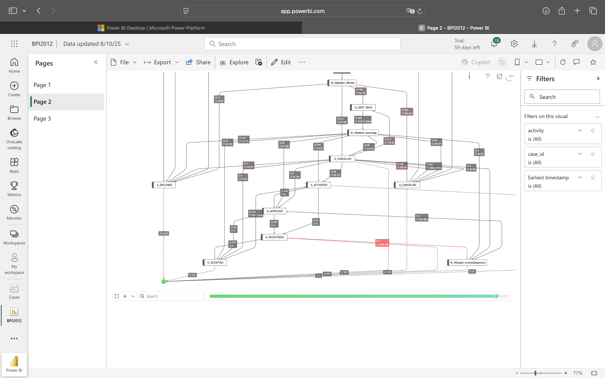
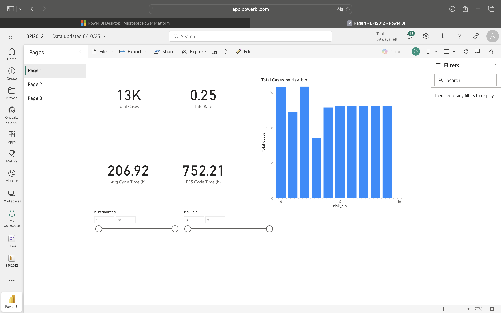
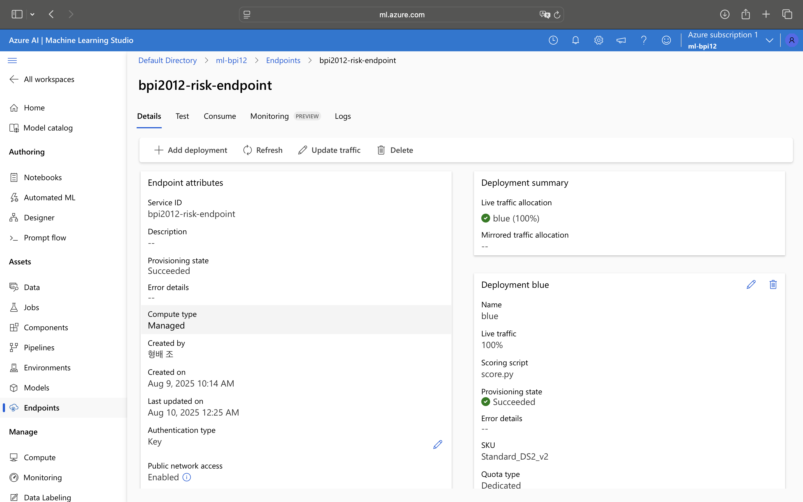
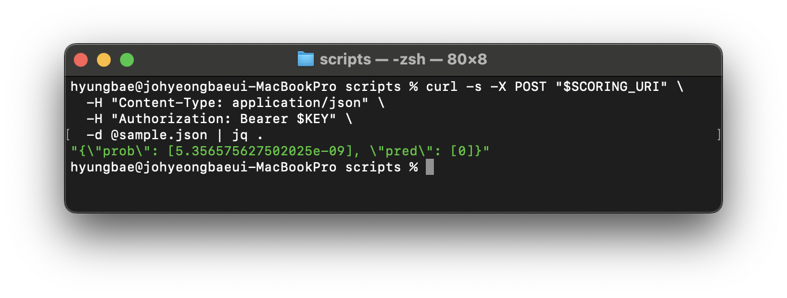

# End‑to‑End Process Mining & Predictive Risk (BPI 2012) — Azure ML + Power BI

<p align="center">
  
  <br><sub>Bottleneck Map — Top transitions by count/avg gap (sample)</sub>
</p>

A compact, reproducible template that mines process bottlenecks and predicts late‑completion risk from an ERP‑style event log.  
Built to mirror the **BIS Data & AI Engineer** remit: data engineering, process mining, Azure ML deployment, and Power BI reporting.

---

## Why this project matters (role alignment)

- **Process analysis & optimisation:** PM4Py EDA (variants, DFG, bottlenecks) on the BPI 2012 event log.  
- **AI & automation:** Baseline XGBoost trained and exposed via **Azure ML Managed Online Endpoint** (REST).  
- **Tooling & dashboards:** **3‑page Power BI (web)** report with a **threshold slider** and **Precision/Recall/F1** cards.  
- **Documentation & reproducibility:** Clean notebooks/scripts, thin architecture, and public artifacts.

---

## What’s included

- **Python**  
  `01_prepare_bpi2012.py` — clean, features, label (q75 late)  
  `02_process_mining_eda.py` — process map + stats  
  `03_train_register_deploy.py` — train → register → deploy (Azure ML)  
  `04_batch_scoring_and_export.ipynb` — batch scoring → CSVs for Power BI (`cases.csv`, `events.csv`, `edges.csv`)

- **Power BI (web, mac‑friendly)**  
  Pages: **Process Health**, **Bottleneck Map**, **Prediction Lens**  
  DAX adds a **what‑if Threshold** and **Precision/Recall/F1**.  

- **Inference**  
  Azure ML **Managed Online Endpoint** with key auth and JSON payloads.

---


## Quick start

1) **Install**
```bash
pip install -r requirements.txt
```

2) **Data**  
Place `BPI_Challenge_2012.xes` (or `bpi2012.csv`) into `data/`.

3) **Run Day 1**
- Run **01 → 02 → 03** (set `AZURE_SUBSCRIPTION_ID`, `AZURE_RESOURCE_GROUP`, `AZURE_ML_WORKSPACE` to register/deploy).

4) **Run Day 2**
- Run **04** to export Power BI data: `artifacts/powerbi/{cases,events,edges}.csv`.
- Build the web report: create a semantic model from `cases.csv`, then add `events.csv`/`edges.csv`.  
  Relationship: `Cases[case_id] 1—* Events[case_id]`.

---

## Modeling summary

- **Label:** late case if total cycle time > **75th percentile** (configurable).  
- **Features (case‑level):** counts (events/resources/activities), inter‑event stats, weekend/working‑hour flags.  
- **Model:** XGBoost baseline → probabilities as `risk_score`.  
- **Evaluation:** F1 / PR‑AUC in 03_train_register_deploy.py; confusion matrix recomputed in Power BI as **threshold** changes.  
- **Batch scoring:** notebook 04 supports **local** or **endpoint** mode and writes CSVs for BI.

---

## Dashboard pages
<p align="center">
  <a href="`https://app.powerbi.com/groups/me/reports/7ef8b675-9274-45fa-a943-4688434280b7?ctid=2eb6774e-6cf6-45a2-9a39-e321dbb6f737&pbi_source=linkShare`" target="_blank">
    
  </a>
  <br><sub>Process Health — Late Rate, Avg/P95 Cycle Time, distributions (sample)</sub>
</p>
- **Process Health:** KPIs (Total Cases, Late Rate, Avg/P95 Cycle Time), distributions, slice by resources/risk bins.  
- **Bottleneck Map:** Edges matrix (from→to with counts/avg gap) or a process‑mining custom visual.  
- **Prediction Lens:** Threshold slider, **Precision/Recall/F1** cards, and a per‑case table (`risk_score`, `y_late`, key drivers).

---

## Architecture (thin slice)

```
BPI2012 (XES/CSV)
      └── 01 Prepare → features + label
            └── 02 EDA (PM4Py)
                  └── 03 Train→Register→Deploy (Azure ML endpoint)
                        └── 04 Batch Score → cases/events/edges CSV
                              └── Power BI (web) dashboards
```

---

## What I contributed / skills demonstrated

- Designed and shipped an **end‑to‑end** pipeline (data → EDA → ML → serving → BI) in a constrained timeframe.  
- Hands‑on with **Azure ML (SDK v2)**: model registration, **Managed Online Endpoint**, key‑auth REST.  
- Built a **browser‑only** Power BI workflow on macOS (semantic model, relationships, DAX, embedded report).  
- Process‑mining analysis with **PM4Py**, translating insights into **actionable BI**.

---

## Live assets

[Power BI 파일(.pbix) 다운로드](BPI2012.pbix)
- **Open interactive report:** `https://app.powerbi.com/groups/me/reports/7ef8b675-9274-45fa-a943-4688434280b7?ctid=2eb6774e-6cf6-45a2-9a39-e321dbb6f737&pbi_source=linkShare`  
- **Repo:** `https://github.com/bwade9090/bis-bpi2012-azureml-mvp.git`

---

## Inference (REST)
<a id="inference-rest"></a>

<p align="center">
  
  <br><sub>Azure ML endpoint — blue deployment live (keys & URI redacted)</sub>
</p>

```bash
# Get scoring URI & key (CLI)
az ml online-endpoint show -n <endpoint> --query scoring_uri -o tsv
az ml online-endpoint get-credentials -n <endpoint> --query primaryKey -o tsv

# Invoke (example)
curl -s -X POST "$SCORING_URI" \
  -H "Content-Type: application/json" \
  -H "Authorization: Bearer $KEY" \
  -d @scripts/sample_request.json
```
<p align="center">
  
  <br><sub>Azure ML endpoint — blue deployment sample curl</sub>
</p>

---

## Data & license

- Dataset: **BPI Challenge 2012** (public process‑mining benchmark).  
- Code: **MIT License**. See `LICENSE`.

---

### Contact

If you’d like a quick walkthrough or access to the endpoint/report, I’m happy to provide a short demo and discuss how this template can be adapted to BIS corporate processes.
